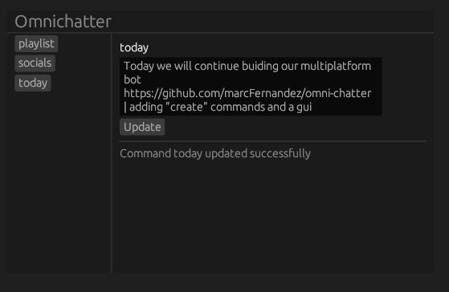

## Twitch bot (for now)

This is a random project being developed live at my [twitch channel](https://twitch.tv/zartisimo) (don't know
how long I'll keep streaming).

Update: Now it also has a UI where you can update the commands too

### Why are you building this?

Because I'm learning [Rust](https://www.rust-lang.org/)

### Episodes

1. Twitch integration and command parsing ([video](https://www.twitch.tv/videos/2014622800))
2. File persistence, refactoring and first multithreading ([video](https://www.twitch.tv/videos/2016632984))
3. Add "create" commands and start building GUI ([video](https://www.twitch.tv/videos/2018412068))
4. Make GUI less ugly
5. ¯\\_(ツ)_/¯

### Goal

Create a multipurpose bot connected to different streaming platforms:

- Twitch
- Youtube
- Kick
- Twitter
